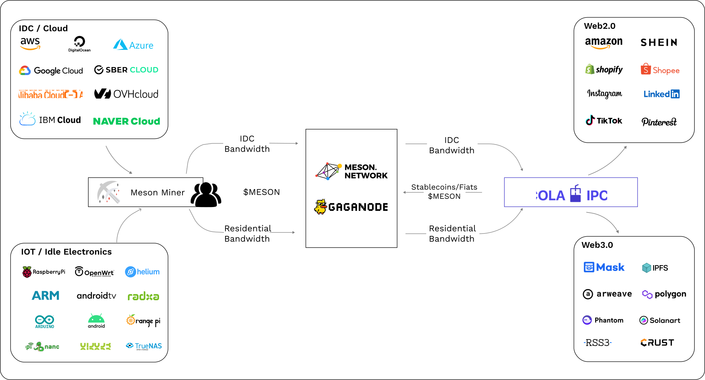

# Introduction

## What is Meson Network?

Meson Network is revolutionizing Web3 by establishing a streamlined bandwidth marketplace through a blockchain protocol, replacing antiquated labor-based sales models. Our innovative approach consolidates and monetizes idle bandwidth from long-tail users at an unprecedented low cost, serving as the cornerstone for decentralized storage, computation, and the burgeoning Web3 Dapp ecosystem.

Our vision extends beyond the present, aiming to forge the world's largest bandwidth marketplace. Meson envisions a future where users effortlessly exchange their surplus bandwidth for tokens, while those in need can access bandwidth globally within Meson's marketplace. Unlike conventional sales models, Meson rejects the top-down approach favored by existing cloud vendors. Instead, we champion an open bandwidth exchange, providing an alternative to address the evolving demands of the dispersed long-tail market.

Traditional sales models, effective in the past, struggle with the growing fragmentation of demand in the long-tail market. Meson Network responds with an alternative - a bottom-up integration of resources. Users can seamlessly contribute or access resources in our marketplace following standardized protocols, eliminating the need for human intermediaries. This groundbreaking model minimizes human interactions and expeditiously scales through free-market mechanisms.

In contrast to the traditional human-centric sales model, Meson's protocol model offers flexibility and scalability without defining rigid roles. Whether it's a casual user connecting their Starlink network or numerous developers linking diverse Telecoms globally, Meson accommodates diverse contributions. Looking ahead, Meson aspires to encompass resources from major cloud vendors like Amazon and Google, envisioning a future where our marketplace extends its reach, all driven by a dedicated team of less than 100 individuals. Join Meson Network in reshaping the future of decentralized connectivity.

## Meson Products

    
        
            
        
        
            <h4>CDN & GatewayX</h4>
            
Decentralized infrastructure based on meson nodes

        
        
            <a target="_blank" href="https://dashboard.meson.network/">Start</a>
        
        
            <a target="_blank" href="https://gatewayx.meson.network/">Docs</a>
        
    
    
        
            
        
        
            <h4>GaGaNode</h4>
            
Next-generation decentralized edge cloud for all platforms

        
        
            <a target="_blank" href="https://gaganode.com/">Start</a>
        
        
            <a target="_blank" href="https://docs.gaganode.com/">Docs</a>
        
    
    
        
            
        
        
            <h4>IPCola</h4>
            
Infrastructure for bigdata and intelligence based on millions of gaga

        
        
            <a target="_blank" href="https://ipcola.com/">Start</a>
        
        
            <a target="_blank" href="https://docs.ipcola.com/">Docs</a>
        
    

## How Meson Network Works

Extended Version: [How Meson Network Works (Official Video)](https://www.youtube.com/watch?v=3Dgwse5mWuA)
 

## Social Media

We have an active and growing community. All are welcome to be part of our community, help shape it, or simply observe.

At any point, feel free to join our [Discord server](https://discord.gg/invite/z6YfSHDkmS) and [Telegram group](https://t.me/mesonnetwork).

Join in the [🦄 Meson BUILDer Program](https://forms.gle/xEavrpdo8j4Mwh2XA).

We also use [GitHub](https://github.com/daqnext) Issues and Discussions.

Or you can follow [Twitter](https://twitter.com/NetworkMeson) and [Medium](https://medium.com/meson-network) for updates.

   

