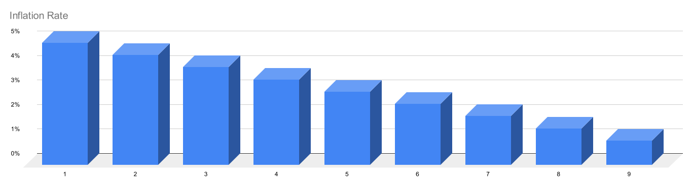

#  $MSN

MSN is Meson.Network's incentive and governance token. It has four primary functions:

- For rewarding miners
- For staking by miners
- As payment by users
- Protocol governance
- The tokens are distributed to network terminals (miners) as rewards for providing server resources.

Currently, there are no benefits for staking the tokens as the functions of transfer for Meson Test Tokens on Ethereum are locked. Users of the services will pay in MSN to get additional bandwidth. These tokens are then rewarded to miners through the repurchase and destruction of tokens.

Meson allows its Token holders to vote on development or modification of parameters of the protocol.

## Token Details

- Token Ticker: MSN
- Initial Supply: 100,000,000 MSN

## Initial Token Launch

- 1.Total initial token supply: 100 million tokens
- 2.Initial supported chains:
  - 2.1 Ethereum Mainnet
  - 2.2 Arbitrum
- 3.Miners have the option to choose either chain 2.1 or 2.2 for token claiming.
- 4.Initial airdrops (if exist) will be distributed on Arbitrum chain.
- 5.Tokens from the investors and public sale will be distributed on Ethereum Mainnet.

::: tip 📝 Note
Meson may expand to additional chains in the future, but the summation of token supply across different chains will remain constant. For instance, if {x number} tokens are burned on chain "A," an equivalent {x number} amount will be minted on chain "B."
:::

## Token Distribution

- Private Token Sale: 26,000,000 MSN (26%)
- Public Token Sale: 5,000,000 MSN (5%)
- Ecosystem: 27,000,000 MSN (27%)
- Foundation Reservation: 20,000,000 MSN (20%)
- Technical Team: 15,000,000 MSN (15%)
- Partners: 6,000,000 MSN (6%)
- Test-Net Mapping: 1,000,000 MSN (1%)

## Token Functions

- Miners get Token rewards after joining the meson network and devoting their server resources.
- Miners can stake MSN to accelerate the mining efficiency.
- Clients use MSN to accelerate any internet media resource e.g file/images/video/streaming/website etc
- Anyone can use MSN for election and voting of on-chain governance/proposals/etc.

## Total Token Inflation

All token inflation comes from mining rewards. The first-year mining inflation rate is 5%. The inflation rate drops 0.5% each year.

## Token Circulation

Miners will get MSN as a reward while providing an idle server to meson.network. Miners will reach full mining speed only if they stack MSN accordingly. Clients send payments to meson.network while using Meson service. All MSN can be exchanged at CEX or DEX.

## GoerliETH Testnet Token Contract(MSN)

Ethereum(Goerli) Contract Address: 0xc08c439c85bd3e65725d08c54fb6f2895436a649

Ethereum(Goerli) Contract: [Source Code](https://goerli.etherscan.io/token/0xc08c439c85bd3e65725d08c54fb6f2895436a649)