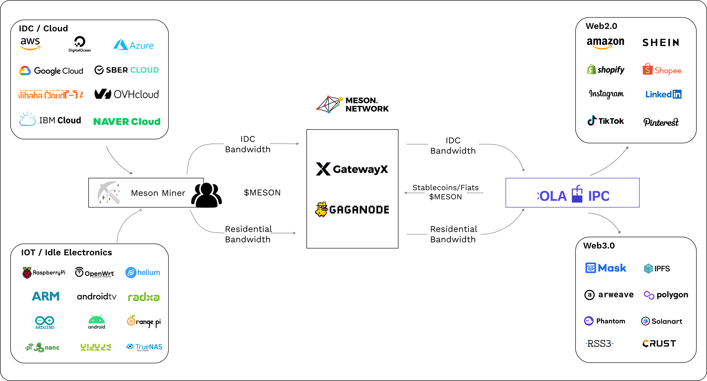

# 🛩️ Meson Products

    
        
            
        
        
            <h4>CDN & GatewayX</h4>
            
Decentralized infrastructure based on meson nodes

        
        
            <a target="_blank" href="https://dashboard.meson.network/">Start</a>
        
        
            <a target="_blank" href="https://gatewayx.meson.network/">Docs</a>
        
    
    
        
            
        
        
            <h4>GaGaNode</h4>
            
Next-generation decentralized edge cloud for all platforms

        
        
            <a target="_blank" href="https://gaganode.com/">Start</a>
        
        
            <a target="_blank" href="https://docs.gaganode.com/">Docs</a>
        
    
    
        
            
        
        
            <h4>IPCola</h4>
            
Infrastructure for bigdata and intelligence based on millions of gaga

        
        
            <a target="_blank" href="https://ipcola.com/">Start</a>
        
        
            <a target="_blank" href="https://docs.ipcola.com/">Docs</a>
        
    

## How Meson Network Works

Extended Version: [How Meson Network Works (Official Video)](https://www.youtube.com/watch?v=3Dgwse5mWuA)
 